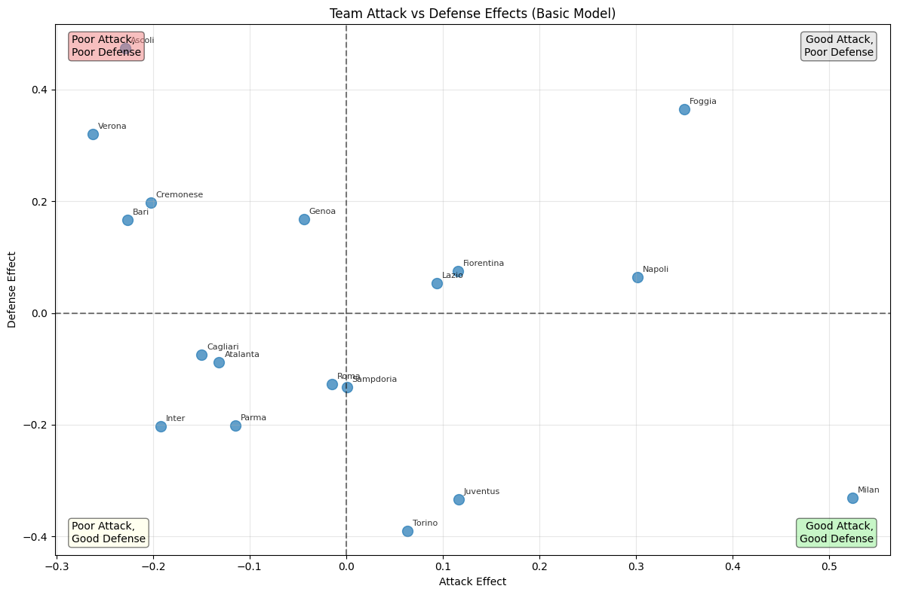
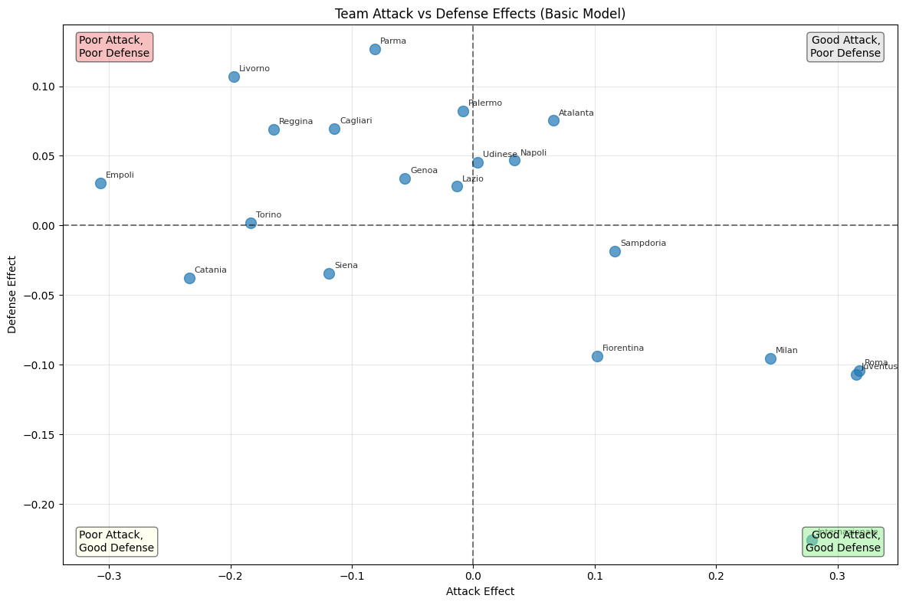
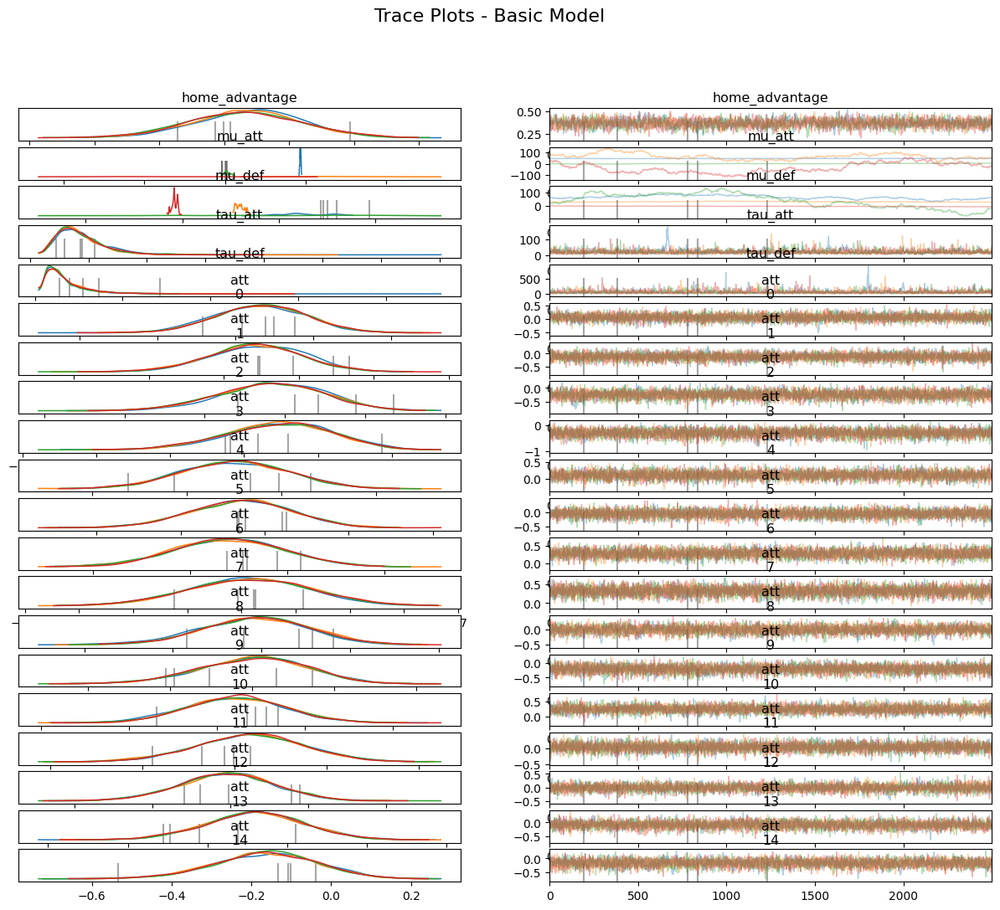
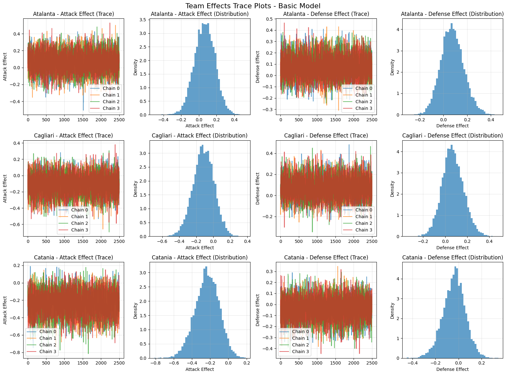
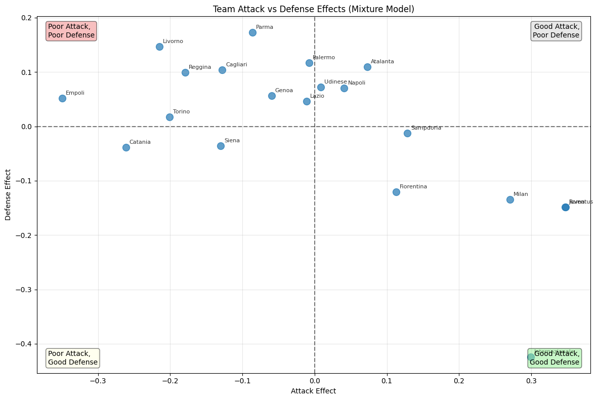
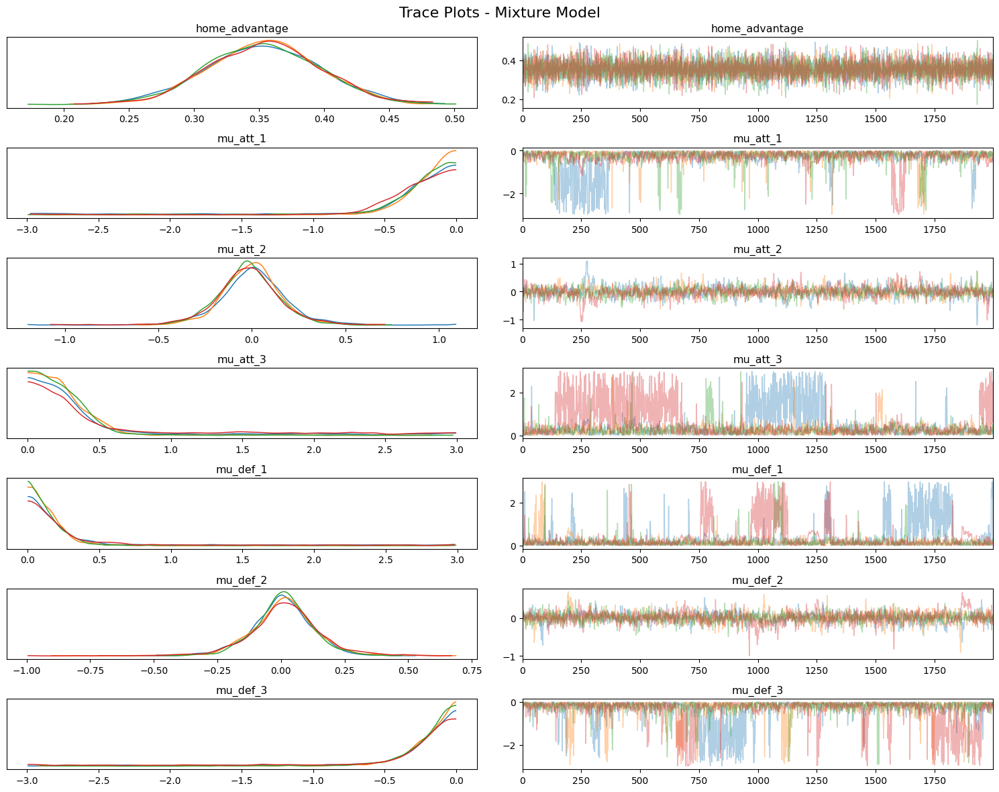
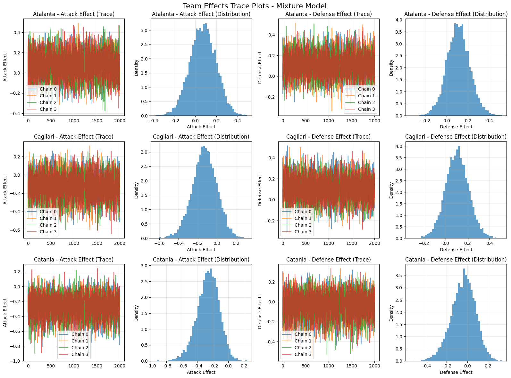
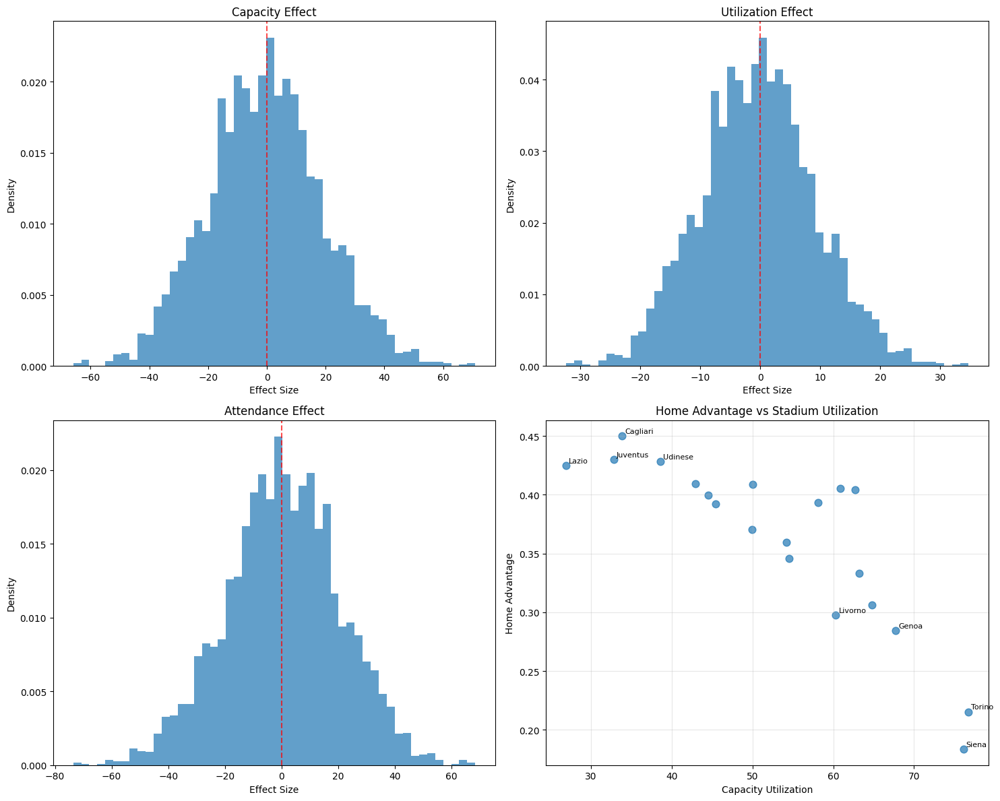
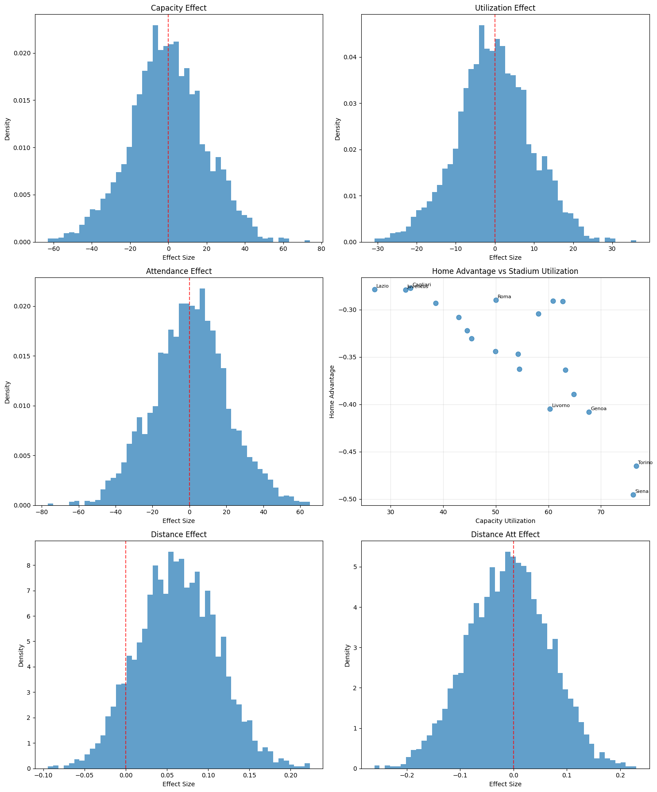

# Basic Code on 1991/92 season (To check similarity with paper values)

    Basic model fitting completed!

    ==================================================
    BASIC MODEL ANALYSIS
    ==================================================

    BASIC MODEL SUMMARY
    ============================================================

    HOME ADVANTAGE EFFECT:
    Mean: 0.2203
    95% CI: [0.1215, 0.3216]
    Interpretation: Home teams score exp(0.2203) = 1.246x more goals on average

    TEAM EFFECTS (all 18 teams):
          team  att_mean  att_median  att_q025  att_q975  def_mean  def_median  def_q025  def_q975
         Milan    0.5242      0.5272    0.3019    0.7494   -0.3312     -0.3250   -0.6608   -0.0247
        Foggia    0.3500      0.3528    0.1146    0.5835    0.3646      0.3688    0.1112    0.5998
        Napoli    0.3018      0.3026    0.0622    0.5310    0.0644      0.0660   -0.2075    0.3188
      Juventus    0.1166      0.1169   -0.1300    0.3545   -0.3338     -0.3296   -0.6512   -0.0471
    Fiorentina    0.1161      0.1202   -0.1461    0.3625    0.0743      0.0750   -0.2050    0.3402
         Lazio    0.0938      0.0921   -0.1642    0.3501    0.0530      0.0529   -0.2025    0.3115
        Torino    0.0637      0.0629   -0.1884    0.3167   -0.3898     -0.3873   -0.7350   -0.0769
     Sampdoria    0.0006      0.0036   -0.2620    0.2594   -0.1326     -0.1308   -0.4197    0.1344
          Roma   -0.0147     -0.0144   -0.2871    0.2442   -0.1276     -0.1286   -0.4108    0.1454
         Genoa   -0.0440     -0.0420   -0.3033    0.2161    0.1679      0.1701   -0.0832    0.4194
         Parma   -0.1150     -0.1124   -0.3986    0.1505   -0.2015     -0.1984   -0.4910    0.0705
      Atalanta   -0.1315     -0.1309   -0.4265    0.1329   -0.0883     -0.0883   -0.3601    0.1712
      Cagliari   -0.1496     -0.1466   -0.4320    0.1118   -0.0741     -0.0710   -0.3444    0.1778
         Inter   -0.1921     -0.1905   -0.4723    0.0639   -0.2031     -0.1993   -0.5055    0.0832
     Cremonese   -0.2023     -0.1963   -0.5002    0.0663    0.1975      0.2011   -0.0502    0.4428
          Bari   -0.2264     -0.2226   -0.5208    0.0438    0.1661      0.1677   -0.0845    0.4104
        Ascoli   -0.2288     -0.2287   -0.5283    0.0545    0.4734      0.4748    0.2456    0.6996
        Verona   -0.2623     -0.2608   -0.5727    0.0211    0.3206      0.3204    0.0713    0.5586

    Basic model fitting completed!

    ==================================================
    BASIC MODEL ANALYSIS
    ==================================================

    BASIC MODEL SUMMARY
    ============================================================

    HOME ADVANTAGE EFFECT:
    Mean: 0.3670
    95% CI: [0.2820, 0.4509]
    Interpretation: Home teams score exp(0.3670) = 1.443x more goals on average

    TEAM EFFECTS:

    Top 5 Attack (most goals scored):
              team  att_mean  att_q025  att_q975
              Roma  0.318216  0.100055  0.537489
          Juventus  0.315369  0.092915  0.531739
    Internazionale  0.279117  0.059266  0.498187
             Milan  0.244670  0.027487  0.467614
         Sampdoria  0.116599 -0.107957  0.335357

    Top 5 Defense (fewest goals conceded - most negative values):
              team  def_mean  def_q025  def_q975
    Internazionale -0.225654 -0.504272 -0.005448
          Juventus -0.107182 -0.333362  0.087130
              Roma -0.104326 -0.331829  0.086103
             Milan -0.095721 -0.313665  0.090272
        Fiorentina -0.093572 -0.319077  0.093729

    Bottom 5 Attack (fewest goals scored):
       team  att_mean  att_q025  att_q975
     Empoli -0.306958 -0.600991 -0.045687
    Catania -0.234131 -0.503940  0.012002
    Livorno -0.197457 -0.466136  0.043973
     Torino -0.183130 -0.449793  0.058602
    Reggina -0.164649 -0.434786  0.079193

    Bottom 5 Defense (most goals conceded - most positive values):
        team  def_mean  def_q025  def_q975
    Cagliari  0.069727 -0.115439  0.269915
    Atalanta  0.075302 -0.106869  0.274730
     Palermo  0.082202 -0.106539  0.282552
     Livorno  0.107157 -0.074162  0.310872
       Parma  0.126512 -0.062089  0.328707

    ======================================================================
    COMPREHENSIVE TRACE PLOT ANALYSIS - BASIC MODEL
    ======================================================================

    1. Main Parameters Trace Plots:

    Generating trace plots for basic model...

    ============================================================
    CONVERGENCE DIAGNOSTICS - BASIC MODEL
    ============================================================
    Error calculating convergence diagnostics: float() argument must be a string or a real number, not 'method'
    This might be due to the trace structure or variable names.
    Attempting basic diagnostics for key parameters...
    Basic diagnostics for ['home_advantage', 'mu_att', 'mu_def']:
      home_advantage: R-hat = 1.0032 ✓, ESS = 2084 ✓
      mu_att: R-hat = 2.1478 ⚠, ESS = 5 ⚠
      mu_def: R-hat = 2.2296 ⚠, ESS = 5 ⚠

    2. Team Effects Trace Plots:

    Generating team effect trace plots for: Atalanta, Cagliari, Catania

    3. Convergence Diagnostics:

    ============================================================
    CONVERGENCE DIAGNOSTICS - BASIC MODEL
    ============================================================
    Error calculating convergence diagnostics: float() argument must be a string or a real number, not 'method'
    This might be due to the trace structure or variable names.
    Attempting basic diagnostics for key parameters...
    Basic diagnostics for ['home_advantage', 'mu_att', 'mu_def']:
      home_advantage: R-hat = 1.0032 ✓, ESS = 2084 ✓
      mu_att: R-hat = 2.1478 ⚠, ESS = 5 ⚠
      mu_def: R-hat = 2.2296 ⚠, ESS = 5 ⚠

    ======================================================================
    TRACE PLOT ANALYSIS COMPLETE
    ======================================================================

    ==================================================
    FITTING MIXTURE MODEL
    ==================================================
    Fitting mixture model...

    Output()

    Mixture model fitting completed!
    ✓ Mixture model fitted successfully!

    ==================================================
    MIXTURE MODEL ANALYSIS
    ==================================================

    MIXTURE MODEL SUMMARY
    ============================================================

    HOME ADVANTAGE EFFECT:
    Mean: 0.3537
    95% CI: [0.2684, 0.4389]
    Interpretation: Home teams score exp(0.3537) = 1.424x more goals on average

    TEAM EFFECTS:

    Top 5 Attack (most goals scored):
              team  att_mean  att_q025  att_q975
              Roma  0.347443  0.119865  0.575032
          Juventus  0.347172  0.119258  0.571869
    Internazionale  0.299442  0.071086  0.526912
             Milan  0.270518  0.029459  0.501001
         Sampdoria  0.128571 -0.113700  0.363733

    Top 5 Defense (fewest goals conceded - most negative values):
              team  def_mean  def_q025  def_q975
    Internazionale -0.423983 -0.820059 -0.094997
          Juventus -0.148678 -0.454223  0.101568
              Roma -0.148092 -0.445332  0.092960
             Milan -0.134868 -0.423375  0.097897
        Fiorentina -0.120359 -0.399863  0.109128

    Bottom 5 Attack (fewest goals scored):
       team  att_mean  att_q025  att_q975
     Empoli -0.349771 -0.697312 -0.067762
    Catania -0.261386 -0.569862 -0.000427
    Livorno -0.215031 -0.497443  0.039548
     Torino -0.201236 -0.484065  0.053004
    Reggina -0.179488 -0.458696  0.079278

    Bottom 5 Defense (most goals conceded - most positive values):
        team  def_mean  def_q025  def_q975
    Cagliari  0.103570 -0.108767  0.320859
    Atalanta  0.109214 -0.104784  0.326867
     Palermo  0.116706 -0.093817  0.333945
     Livorno  0.146957 -0.057641  0.363708
       Parma  0.172534 -0.034212  0.395836

    ======================================================================
    COMPREHENSIVE TRACE PLOT ANALYSIS - MIXTURE MODEL
    ======================================================================

    1. Main Parameters Trace Plots:

    Generating trace plots for mixture model...

    ============================================================
    CONVERGENCE DIAGNOSTICS - MIXTURE MODEL
    ============================================================
    Error calculating convergence diagnostics: float() argument must be a string or a real number, not 'method'
    This might be due to the trace structure or variable names.
    Attempting basic diagnostics for key parameters...
    Basic diagnostics for ['home_advantage', 'mu_att_1', 'mu_att_2']:
      home_advantage: R-hat = 1.0008 ✓, ESS = 13250 ✓
      mu_att_1: R-hat = 1.0168 ✓, ESS = 329 ⚠
      mu_att_2: R-hat = 1.0104 ✓, ESS = 776 ✓

    2. Team Effects Trace Plots:

    Generating team effect trace plots for: Atalanta, Cagliari, Catania

    3. Convergence Diagnostics:

    ============================================================
    CONVERGENCE DIAGNOSTICS - MIXTURE MODEL
    ============================================================
    Error calculating convergence diagnostics: float() argument must be a string or a real number, not 'method'
    This might be due to the trace structure or variable names.
    Attempting basic diagnostics for key parameters...
    Basic diagnostics for ['home_advantage', 'mu_att_1', 'mu_att_2']:
      home_advantage: R-hat = 1.0008 ✓, ESS = 13250 ✓
      mu_att_1: R-hat = 1.0168 ✓, ESS = 329 ⚠
      mu_att_2: R-hat = 1.0104 ✓, ESS = 776 ✓

    ======================================================================
    TRACE PLOT ANALYSIS COMPLETE
    ======================================================================

    ==================================================
    SEASON COMPARISON ANALYSIS
    ==================================================
    Simulating 1500 scenarios for basic model predictions...
    Simulating 1500 scenarios for mixture model predictions...

    ==========================================================================================================================================================================
    EXTENDED SEASON RESULTS COMPARISON - OBSERVED vs BASIC vs MIXTURE MODELS
    ==========================================================================================================================================================================
    team                          Observed results                            Basic model (medians)                        Mixture model (medians)
                      pts   sc   co   W   D   L   pts   sc   co   W   D   L   pts   sc   co   W   D   L
    --------------------------------------------------------------------------------------------------------------------------------------------------------------------------
    Internazionale    85  69  26 25 10  3   69  63  37 20  9  9   75  64  30 22  9  7
    Roma              82  72  37 24 10  4   67  65  42 19  9 10   69  66  40 20  9  9
    Juventus          72  72  37 20 12  6   67  64  41 19  9 10   69  66  40 20  8  9
    Fiorentina        66  55  39 19  9 10   59  52  43 16 10 12   59  52  42 17 10 12
    Milan             64  66  38 18 10 10   64  60  43 18  9 11   66  62  41 19  9 10
    Sampdoria         60  56  46 17  9 12   56  53  47 16  9 13   57  53  47 16  9 13
    Udinese           57  48  53 16  9 13   50  46  50 14 10 15   50  48  51 13  9 15
    Napoli            50  50  53 14  8 16   51  48  50 14  9 15   51  49  51 14  9 15
    Genoa             48  44  52 13  9 16   49  44  49 13 10 15   48  44  50 13 10 15
    Atalanta          48  52  56 12 12 14   51  50  51 14  9 15   50  50  53 14  9 15
    Palermo           47  47  57 12 11 15   49  46  51 13  9 15   48  46  53 13  9 16
    Lazio             46  47  51 11 13 14   50  46  49 14 10 15   50  46  50 13 10 15
    Siena             44  40  45  9 17 12   49  42  46 13 10 15   48  41  46 13 10 15
    Cagliari          42  40  56 11  9 18   46  42  51 12 10 16   44  41  53 11 10 17
    Torino            40  36  49  8 16 14   46  40  48 12 10 16   44  38  49 11 10 16
    Reggina           40  37  56  9 13 16   44  40  52 11 10 16   43  39  53 11 10 17
    Catania           37  33  45  8 13 17   46  38  46 12 10 16   45  37  46 11 11 16
    Empoli            36  29  52  9  9 20   41  35  50 10 10 17   39  33  51 10 10 18
    Parma             34  42  62  7 13 18   45  43  54 12 10 17   44  43  56 11  9 17
    Livorno           30  35  60  6 12 20   42  38  54 11 10 17   41  38  55 10 10 18

    ==========================================================================================
    MODEL PERFORMANCE COMPARISON - MEAN ABSOLUTE ERROR
    ==========================================================================================
    Basic Model Performance:
      Points MAE:          6.05
      Goals Scored MAE:    3.35
      Goals Conceded MAE:  4.00
      Wins MAE:            2.45
      Draws MAE:           2.20
      Losses MAE:          2.05
      Total MAE:           20.10

    Mixture Model Performance:
      Points MAE:          4.90
      Goals Scored MAE:    2.50
      Goals Conceded MAE:  2.55
      Wins MAE:            2.00
      Draws MAE:           2.20
      Losses MAE:          1.75
      Total MAE:           15.90

    ============================================================
    MODEL COMPARISON SUMMARY
    ============================================================
    🏆 MIXTURE MODEL WINS with lower total MAE (15.90 vs 20.10)
       Mixture model is 20.9% better overall

    Category Winners:
      Points:   Mixture (4.90)
      Scored:   Mixture (2.50)
      Conceded: Mixture (2.55)
      Wins:     Mixture (2.00)
      Draws:    Mixture (2.20)
      Losses:   Mixture (1.75)
    Simulating 1500 scenarios for basic model predictions...
    Simulating 1500 scenarios for mixture model predictions...

    ======================================================================
    DETAILED MODEL DIFFERENCES ANALYSIS
    ======================================================================

    Teams where MIXTURE model predicts closer to observed results:
      Internazionale : Basic error 16.0, Mixture error 10.0 (improvement: 6.0)
      Roma           : Basic error 15.0, Mixture error 13.0 (improvement: 2.0)
      Juventus       : Basic error 5.0, Mixture error 3.0 (improvement: 2.0)
      Torino         : Basic error 6.0, Mixture error 4.0 (improvement: 2.0)
      Empoli         : Basic error 5.0, Mixture error 3.0 (improvement: 2.0)

    Teams where BASIC model predicts closer to observed results:
      Milan          : Mixture error 2.0, Basic error 0.0 (improvement: 2.0)

    Largest differences between Basic and Mixture model predictions:
      Internazionale : Pts  +6, W +2, D +0, L -2
      Juventus       : Pts  +2, W +1, D -1, L -1
      Milan          : Pts  +2, W +1, D +0, L -1
      Roma           : Pts  +2, W +1, D +0, L -1
      Cagliari       : Pts  -2, W -1, D +0, L +1

    ======================================================================
    SUMMARY STATISTICS
    ======================================================================
    Teams where mixture model is better: 15
    Teams where basic model is better: 1
    Average absolute difference in points: 1.35
    Average absolute difference in goals scored: 0.85
    Average absolute difference in goals conceded: 1.45
    Average absolute difference in wins: 0.65
    Average absolute difference in draws: 0.20
    Average absolute difference in losses: 0.50

    Correlation with observed results:
    Points - Basic: 0.965, Mixture: 0.965
    Wins   - Basic: 0.938, Mixture: 0.947
    Points winner: Basic model
    Wins winner:   Mixture model
    Simulating 1500 scenarios for basic model predictions...
    Simulating 1500 scenarios for mixture model predictions...
    Extended comparison table saved to football_analysis_results_20250725_101715.csv

    ✓ Results saved to: football_analysis_results_20250725_101715.csv

    ==================================================
    EXAMPLE MATCH PREDICTIONS
    ==================================================

    Internazionale vs Milan (Basic Model):
      Expected goals: 1.72 - 1.02
      Probabilities: Home 0.524, Draw 0.276, Away 0.200
    Internazionale vs Milan (Mixture Model):
      Expected goals: 1.71 - 0.88
      Probabilities: Home 0.581, Draw 0.232, Away 0.187

    Roma vs Lazio (Basic Model):
      Expected goals: 2.05 - 0.91
      Probabilities: Home 0.648, Draw 0.190, Away 0.162
    Roma vs Lazio (Mixture Model):
      Expected goals: 2.13 - 0.87
      Probabilities: Home 0.657, Draw 0.189, Away 0.154

    Juventus vs Napoli (Basic Model):
      Expected goals: 2.10 - 0.93
      Probabilities: Home 0.629, Draw 0.212, Away 0.159
    Juventus vs Napoli (Mixture Model):
      Expected goals: 2.18 - 0.92
      Probabilities: Home 0.661, Draw 0.202, Away 0.137

    ======================================================================
    ANALYSIS COMPLETE!
    ======================================================================

    🎉 SUCCESS! All analysis completed.

    You can now use the model object to:
    - model.predict_match('Team1', 'Team2', 'basic')
    - model.plot_team_effects('mixture')
    - model.print_model_summary('basic')
    - model.create_extended_comparison_table()
    - model.generate_all_traceplots('basic')
    - model.plot_traceplots('mixture')
    - model.plot_team_effect_traceplots('basic', ['Juventus', 'Milan'])

    ================================================================================
    ENHANCED BAYESIAN FOOTBALL MODEL
    With Stadium, Distance, and Temporal Covariates
    ================================================================================
    ================================================================================
    ENHANCED BAYESIAN FOOTBALL MODEL WITH COVARIATES
    Stadium Capacity + Attendance + Distance + Temporal Effects
    ================================================================================
    Initializing enhanced model with data file: final_dataset_200708_stadiumdistancedate.xlsx
    Original data shape: (380, 17)
    Columns: ['hometeam_id', 'awayteam_id', 'hometeam_name', 'awayteam_name', 'y1', 'y2', 'matchday', 'points home', 'points away', 'average_attendance', 'capacity_utilization', 'stadium_capacity', 'home_stadium', 'away_stadium', 'distance', 'date', 'weekday']
    Data loaded: 380 games, 20 teams

    ============================================================
    PREPARING COVARIATES
    ============================================================

    1. STADIUM CHARACTERISTICS:
       Available stadium columns: ['average_attendance', 'capacity_utilization', 'stadium_capacity', 'home_stadium', 'away_stadium']
       ✓ Stadium characteristics prepared for 20 teams
       Stadium capacity range: 13500 - 85421
       Capacity utilization range: 26.900 - 76.700

    2. DISTANCE EFFECTS:
       Available distance columns: ['distance']
       ✓ Using column 'distance' for travel distances
       Distance range: 0.0 - 1046.9 km
       ✓ Sample distances created, range: 0.0 - 1046.9 km

    3. TEMPORAL EFFECTS:
       Available date columns: ['date', 'weekday']
       ✓ Using column 'date' for temporal effects
       Date range: 2007-08-25 00:00:00 to 2008-05-18 00:00:00

    4. STANDARDIZING COVARIATES:
       stadium_capacity: mean=46162.89, std=24140.55
       average_attendance: mean=23641.28, std=13318.79
       capacity_utilization: mean=53.20, std=13.62
       travel_distance: mean=431.91, std=281.00
       ✓ All covariates standardized

    ✓ All covariates prepared successfully
    ✓ Model initialization completed successfully
    ✓ Final check - n_games: 380, n_teams: 20

    ============================================================
    FITTING BASIC MODEL
    ============================================================
    Fitting basic hierarchical model...
    Building basic hierarchical model...
    ✓ Basic model built successfully

    Basic model fitting completed!

    ============================================================
    CONVERGENCE DIAGNOSTICS FOR BASIC MODEL
    ============================================================
       Error calculating R-hat: float() argument must be a string or a real number, not 'Dataset'
       Error calculating ESS: ess() got an unexpected keyword argument 'kind'

    ============================================================
    FITTING ENHANCED STADIUM MODEL
    ============================================================
    Fitting enhanced model with stadium covariates...
    Building enhanced model with stadium-based home advantage...
    ✓ Enhanced stadium model built successfully

    Enhanced model fitting completed!

    ============================================================
    CONVERGENCE DIAGNOSTICS FOR ENHANCED STADIUM MODEL
    ============================================================
       Error calculating R-hat: float() argument must be a string or a real number, not 'Dataset'
       Error calculating ESS: ess() got an unexpected keyword argument 'kind'

    ======================================================================
    COVARIATE EFFECTS ANALYSIS - ENHANCED STADIUM MODEL
    ======================================================================

    1. STADIUM EFFECTS ON HOME ADVANTAGE:
       beta_capacity: -0.6390 [-37.7498, 39.0700] • Not significant
       beta_utilization: -0.3776 [-18.5833, 19.0474] • Not significant
       beta_attendance: 0.6875 [-40.4696, 39.1651] • Not significant
       beta_interaction: -0.1411 [-9.6342, 10.0203] • Not significant

    4. TEAM-SPECIFIC HOME ADVANTAGES:

       Top 5 teams with highest home advantage:
        team  home_advantage   capacity  utilization  attendance
    Cagliari          0.4501 40018.6391         33.8     13526.3
    Juventus          0.4302 70940.2439         32.8     23268.4
     Udinese          0.4283 41723.5751         38.6     16105.3
       Lazio          0.4247 83017.1004         26.9     22331.6
     Catania          0.4097 39958.2751         42.9     17142.1

       Bottom 5 teams with lowest home advantage:
       team  home_advantage   capacity  utilization  attendance
    Palermo          0.3065 36980.2469         64.8     23963.2
    Livorno          0.2974 18189.7181         60.3     10968.4
      Genoa          0.2844 33215.3619         67.7     22486.8
     Torino          0.2154 25382.5293         76.7     19468.4
      Siena          0.1833 13500.2628         76.1     10273.7

    ============================================================
    FITTING FULL COVARIATE MODEL
    ============================================================
    Fitting full covariate model...
    Building full covariate model with stadium, distance, and temporal effects...
    ✓ Full covariate model built successfully

    Output()

    Full covariate model fitting completed!

    ============================================================
    CONVERGENCE DIAGNOSTICS FOR FULL COVARIATE MODEL
    ============================================================
       Error calculating R-hat: float() argument must be a string or a real number, not 'Dataset'
       Error calculating ESS: ess() got an unexpected keyword argument 'kind'

    ======================================================================
    COVARIATE EFFECTS ANALYSIS - FULL COVARIATE MODEL
    ======================================================================

    1. STADIUM EFFECTS ON HOME ADVANTAGE:
       beta_capacity: -0.3930 [-40.6978, 38.5366] • Not significant
       beta_utilization: -0.2476 [-19.9742, 18.7930] • Not significant
       beta_attendance: 0.4380 [-39.8663, 42.2739] • Not significant

    2. DISTANCE EFFECTS:
       beta_distance: 0.0632 [-0.0283, 0.1575] • Not significant
       beta_distance_att: -0.0090 [-0.1595, 0.1361] • Not significant
       beta_distance_def: -0.0203 [-0.1728, 0.1310] • Not significant

    3. TEMPORAL EFFECTS:
       beta_weekend: -0.0900 [-0.3341, 0.1514] • Not significant
       beta_season[Early]: 0.7474 [-30.4869, 31.2545] • Not significant
       beta_season[Mid]: 0.4944 [-42.4388, 43.8383] • Not significant
       beta_season[Late]: 0.9126 [-30.3552, 31.4303] • Not significant

    4. TEAM-SPECIFIC HOME ADVANTAGES:

       Top 5 teams with highest home advantage:
              team  home_advantage   capacity  utilization  attendance
          Cagliari         -0.2771 40018.6391         33.8     13526.3
             Lazio         -0.2786 83017.1004         26.9     22331.6
          Juventus         -0.2792 70940.2439         32.8     23268.4
              Roma         -0.2898 82852.6000         50.0     41426.3
    Internazionale         -0.2906 85420.5255         60.9     52021.1

       Bottom 5 teams with lowest home advantage:
       team  home_advantage   capacity  utilization  attendance
    Palermo         -0.3893 36980.2469         64.8     23963.2
    Livorno         -0.4049 18189.7181         60.3     10968.4
      Genoa         -0.4081 33215.3619         67.7     22486.8
     Torino         -0.4652 25382.5293         76.7     19468.4
      Siena         -0.4957 13500.2628         76.1     10273.7

    ================================================================================
    COMPREHENSIVE MODEL COMPARISON
    ================================================================================

    1. MODEL SELECTION CRITERIA:
       Error calculating criteria for basic: log likelihood not found in inference data object
       Error calculating criteria for enhanced: log likelihood not found in inference data object
       Error calculating criteria for full: log likelihood not found in inference data object

    ============================================================================================================================================
    ENHANCED SEASON RESULTS COMPARISON - ALL MODELS
    ============================================================================================================================================
    team                  Observed              Basic               Enhanced               Full
                       pts scored conceded    pts scored conceded    pts scored conceded    pts scored conceded
    --------------------------------------------------------------------------------------------------------------------------------------------
    Internazionale     85    69    26    76    57    33    76    57    34    71    55    34
    Roma               82    72    37    71    56    40    72    56    39    71    57    40
    Juventus           72    72    37    72    56    39    71    56    40    72    57    38
    Fiorentina         66    55    39    52    46    41    46    43    41    49    44    40
    Milan              64    66    38    69    55    40    69    55    40    72    56    38
    Sampdoria          60    56    46    54    48    42    48    45    42    40    41    42
    Udinese            57    48    53    32    38    44    38    40    42    37    40    43
    Napoli             50    50    53    36    40    44    36    39    42    40    42    44
    Genoa              48    44    52    34    38    42    33    38    43    36    39    42
    Atalanta           48    52    56    39    42    45    43    43    43    42    42    42
    Palermo            47    47    57    31    38    45    30    38    46    31    39    48
    Lazio              46    47    51    33    38    43    36    39    42    36    39    42
    Siena              44    40    45    34    38    42    36    38    41    34    38    42
    Cagliari           42    40    56    32    38    44    31    37    45    32    37    45
    Torino             40    36    49    34    37    42    34    37    42    33    38    43
    Reggina            40    37    56    31    37    45    31    38    45    29    37    47
    Catania            37    33    45    34    37    42    34    37    42    35    33    41
    Empoli             36    29    52    32    33    42    32    32    42    31    34    44
    Parma              34    42    62    30    38    46    29    38    47    33    39    45
    Livorno            30    35    60    31    37    45    30    38    46    32    37    44

    ============================================================
    MEAN ABSOLUTE ERROR COMPARISON
    ============================================================

    BASIC MODEL:
      Points MAE:   9.15
      Scored MAE:   7.25
      Conceded MAE: 7.80
      Total MAE:    24.20

    ENHANCED MODEL:
      Points MAE:   9.15
      Scored MAE:   7.50
      Conceded MAE: 8.00
      Total MAE:    24.65

    FULL MODEL:
      Points MAE:   9.60
      Scored MAE:   7.20
      Conceded MAE: 7.60
      Total MAE:    24.40

    🏆 BEST PREDICTIVE MODEL: BASIC
       Total MAE: 24.20

    🎉 SUCCESS! Enhanced analysis completed.

    Available methods:
    - model.analyze_covariate_effects('enhanced' or 'full')
    - model.plot_covariate_effects('enhanced' or 'full')
    - model.compare_all_models()
    - model.print_enhanced_comparison_table()
